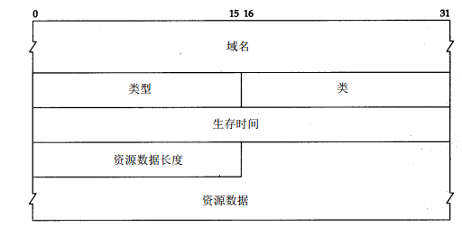
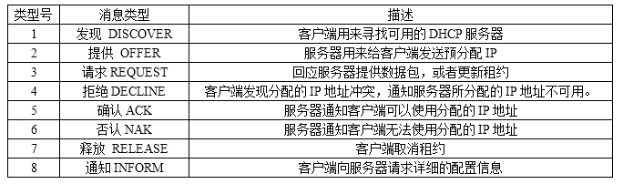
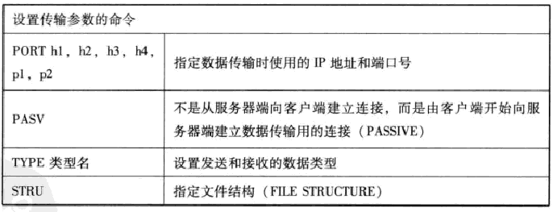

[TOC]

# 应用层
## 域名系统DNS（Domain Name System）
提供主机名字和 I P地址之间的转换及有关电子邮件的选路信息。基于UDP/TCP协议，端口号53，主要使用UDP协议，当数据超出UDP数据报最大长度，便使用TCP。

### 域名
**图：域名的分层结构**


### DNS报文
```
DNS ID号：用来对应DNS查询和DNS响应。
查询/响应QR：1bit，用来注明这个数据包是DNS查询还是响应，0表示查询，1表示响应。
操作代码opcode：4bit，用来定义消息中的请求类型，0表示标准查询，1表示反向查询，2表示服务器状态请求。
权威应答AA：1bit，设定该值，说明该响应是有域内权威域名服务器发出的。
截断TC：1bit，设定该值，说明响应太长被截断。
期望递归RD：1bit，置1，说明目标服务器不含有请求信息的情况下，要求进行递归查询。
可用递归RA：1bit，置1，说明域名服务器支持递归查询。
保留Z：3bit，设为0。
响应代码Respon Code：在DNS响应中用来指明错误。0表示没有差错，3表示名字差错，名字差错
问题计数：在问题区段中的条目数。
回答计数：在回答区段中的条目数。
域名服务器计数：在权威区段的域名资源记录数
额外记录计数：在额外信息区段中其他资源记录数
问题区段：大小可变，包含有被发送到DNS服务器的一条或多条的信息查询的部分。
回答区段：大小可变，含有被用来回答查询的一条或多条资源记录。
权威区段：大小可变，包含指向权威域名服务器的资源记录，用以继续解析过程。
额外信息区段：包含资源记录且大小可变的区段，这些资源记录用来存储完全没有必要回答的查询相关的额外信息。
```

**图：DNS数据包结构**


### DNS查询过程
1. 简单DNS查询包：
    ```
    问题计数置1，其他计数为0，
    问题区段保存查询名Name（长度不定），
    查询类型Type（16bit）为A，值为1，表示IPv4主机地址，
    查询类Class（16bit）为IN，值为1，表示互联网地址。
    ```

    **图：问题部分格式**
    

    **图：查询名geimini.tuc.noao.edu的保存形式**
    

2. 简单DNS响应包：
    ```
    DNS ID号与查询包一致，QR置1，问题计数为1，回答计数为1，因为原问题和回答连接起来了。
    回答区段域名标识符值为0xc00c表示使用压缩方式，域名在报文的0x0c处（因为返回结果会有许多重复域名，因此域名标识符（16bit）使用压缩方式，需将最高两位设置为11，其余14bit说明该DNS报文中域名标识符所在的位置。）。
    查询类型Type（16bit）为A，值为1，表示IPv4主机地址，
    查询类Class（16bit）为IN，值为1，生存时间（32bit，单位为秒），
    资源数据长度（16bit）为0x0004，资源数据为4字节的IP地址。
    ```

    **图：资源记录格式（回答、权威、额外信息字段使用）**
    

3. 常用DNS资源记录类型

|值|类型|描述|
|---|---|----|
|1|A|IPv4主机地址|
|2|NS|权威域名服务器|
|5|CNAME|规范别名|
|15|MX|邮件交换|
|28|AAAA|IPv6主机地址|

## 动态主机配置协议DHCP
让设备自动获取IP地址。基于UDP协议，端口号67、68。
### DHCP头结构
```
消息类型：指出数据包是DHCP请求还是回复，01为请求，02为响应。
硬件类型：硬件地址类型。
硬件长度：硬件地址长度。
跳数：中继代理用来帮助寻找DHCP服务器
事务ID：用来匹配请求和响应的一个随机数。
消耗时间：客户端第一次向DHCP服务器发出地址请求后的时间。
标记：DHCP客户端能够接受的流量类型。
客户端IP地址：由“你的”IP地址域派生
“你的”IP地址：DHCP服务器提供的IP地址
服务器IP地址：DHCP服务器的IP地址
网关IP地址：网络默认网关的IP地址
客户端硬件地址：客户端的MAC地址
服务器主机名：服务器主机名（可选）
启动文件：DHCP所使用的启动文件。（可选）
选项：用来对DHCP数据包进行扩展以提供更多功能，格式为代码+长度+数据。
```

**图：DHCP数据包结构**


**图：DHCP数据包选项**


**图：DHCP数据包类型**


### DHCP获取IP地址：DORA过程
因为使用了4种类型的DHCP数据包，发现Discover，提供Offer，请求Request，确认Acknowledgement

1. 发现阶段，即DHCP客户机寻找DHCP服务器的阶段。DHCP客户机以广播方式（因为DHCP服务器的IP地址对于客户机来说是未知的）发送DHCP discover发现信息来寻找DHCP服务器，即向地址255.255.255.255发送特定的广播信息。网络上每一台安装了TCP/IP协议的主机都会接收到这种广播信息，但只有DHCP服务器才会做出响应。
发现数据包的目标MAC地址为ff:ff:ff:ff:ff:ff，源IP地址为0.0.0.0，目标IP地址为255.255.255.255，源端口68，目标端口67，DHCP信息类型值为01，是请求包，其选项中保存DHCP数据包类型，类型为53 ，长度为1，值为1。
2. 提供阶段，即DHCP服务器提供IP地址的阶段。在网络中接收到DHCP discover发现信息的DHCP服务器都会做出响应，它从尚未出租的IP地址中挑选一个分配给DHCP客户机，向DHCP客户机发送一个包含出租的IP地址和其他设置的DHCP offer提供信息。
目标IP地址设置为出租的IP地址，DHCP数据中消息类型值为02，是响应包，事务ID与发现包的相同，“你的”IP地址设置为出租的IP地址，服务器IP地址设置为默认网关的IP地址，选项中提供数据包类型（值为2，是提供包）、子网掩码、续租时间、租期、重新绑定的时间和DHCP服务器标识符。
3. 选择阶段，即DHCP客户机选择某台DHCP服务器提供的IP地址的阶段。如果有多台DHCP服务器向DHCP客户机发来的DHCP offer提供信息，则DHCP客户机只接受第一个收到的DHCP offer提供信息，然后它就以广播方式回答一个DHCP request请求信息，该信息中包含向它所选定的DHCP服务器请求IP地址的内容。之所以要以广播方式回答，是为了通知所有的DHCP服务器，他将选择某台DHCP服务器所提供的IP地址。
数据包源IP地址为0.0.0.0，DHCP数据包消息类型值为01，是请求包；事务ID是新的；其所有IP地址信息为空，与发现数据包类似；选项中设置DHCP数据包类型（值为3，为请求包）、请求IP地址和DHCP服务器标识符。
4. 确认阶段，即DHCP服务器确认所提供的IP地址的阶段。当DHCP服务器收到DHCP客户机回答的DHCP request请求信息之后，它便向DHCP客户机发送一个包含它所提供的IP地址和其他设置的DHCP ACK确认信息，告诉DHCP客户机可以使用它所提供的IP地址。然后DHCP客户机便将其TCP/IP协议与网卡绑定，另外，除DHCP客户机选中的服务器外，其他的DHCP服务器都将收回曾提供的IP地址。确认数据包与提供数据包相似，事务ID为客户端选择阶段发送请求包的事务ID，选项中的数据包类型值为5，为确认包。
### 续租IP地址（只需请求包和确认包）
1. DHCP客户机启动时和IP租约期限过一半时，DHCP客户机都会自动向DHCP服务器发送更新其IP租约的信息。发送包含前一次所分配的IP地址的DHCP request请求信息。
当DHCP服务器收到这一信息后，它会尝试让DHCP客户机继续使用原来的IP地址，并回答一个DHCP ACK确认信息。
2. 如果此IP地址已无法再分配给原来的DHCP客户机使用时（比如此IP地址已分配给其它DHCP客户机使用），则DHCP服务器给DHCP客户机回答一个DHCP NACK否认信息。当原来的DHCP客户机收到此DHCP NACK否认信息后，它就必须重新发送DHCP discover发现信息来请求新的IP地址。

## 文件传送协议FTP
使用两条TCP连接，一条用来控制、一条用来数据的传输。FTP控制默认使用21端口，明文传输，用来发送用户名和密码的验证、发送文件的名称、发送方式的设置。数据传输的TCP、连接通常使用端口20，客户端使用NAT连接外部FTP服务器是无法直接建立传输数据时使用的TCP连接，必须使用PASV命令修改建立连接的方向，由客户端开始向服务器将建立数据连接。

### FTP主要命令





### FTP的主要应答消息


## 简单邮件传送协议SMTP    
用于发送邮件，使用TCP25端口，建立连接后，客户端以文本形式发送请求，服务端返回一个3位数字的应答。每个指令和应答的最后都必须追加换行指令（CR、LF）。SMTP本身没有验证发送者的功能，所以无法避免广告、垃圾邮件。不过现在邮件服务器都会进行身份认证。

### SMTP主要命令


### SMTP应答


## 超文本传输协议HTTP
### URI
用于标识资源。如```http://www.ietf.org:80/```index.html，属于一般主页地址，也被叫做URL。
URL通用格式为```<scheme>://<netloc>:<port>/<path>?<query>#<fragment>```，比如
```
http://www.foo.com/path/f.php?id=1&type=cool#new，
其对应关系为，
scheme--->http
netloc--->www.foo.com
path--->/path/f.php
query--->id=1&type=cool
fragment--->new
省略端口时，表示采用http默认端口80。
```
### 工作过程
服务器默认使用80端口，客户端向服务器的80端口建立一个TCP连接，在此基础上进行请求和应答及数据报文的发送。HTTP常用版本有HTTP1.0与HTTP1.1。HTTP1.0每一命令与应答会触发一次TCP连接的建立和断开，而从HTTP1.1开始，允许在一个TCP连接上发送多个命令和应答，提高效率。
### 请求
由三部分组成，分别是：请求行、消息报头、请求正文
1. 请求行以一个方法符号开头，以空格分开，后面跟着请求的URI和协议的版本，
格式如下：
```
Method Request-URI HTTP-Version CRLF
其中 Method表示请求方法；
Request-URI是一个统一资源标识符；
HTTP-Version表示请求的HTTP协议版本；
CRLF表示回车和换行（除了作为结尾的CRLF外，不允许出现单独的CR或LF字符）。
```

2. 有多种请求方法（所有方法全为大写），解释如下：

|方法名|解释|
|------|----|
|GET|请求获取Request-URI所标识的资源|
|POST|在Request-URI所标识的资源后附加新的数据|
|HEAD|请求获取由Request-URI所标识的资源的响应消息报头|
|PUT|请求服务器存储一个资源，并用Request-URI作为其标识|
|DELETE|请求服务器删除Request-URI所标识的资源|
|TRACE|请求服务器回送收到的请求信息，主要用于测试或诊断|
|CONNECT|保留将来使用|
|OPTIONS|请求查询服务器的性能，或者查询与资源相关的选项和需求|

3. 应用举例：
     - GET方法：在浏览器的地址栏中输入网址的方式访问网页时，浏览器采用GET方法向服务器获取资源，
    例：
    ```
    GET /form.html HTTP/1.1 (CRLF)
    ```
     - POST方法：要求被请求服务器接受附在请求后面的数据，常用于提交表单。
    例：
    ```
    POST /reg.jsp HTTP/ (CRLF)
    Accept:image/gif,image/x-xbit,... (CRLF)
    ...
    HOST:www.guet.edu.cn (CRLF)
    Content-Length:22 (CRLF)
    Connection:Keep-Alive (CRLF)
    Cache-Control:no-cache (CRLF)
    (CRLF)         //该CRLF表示消息报头已经结束，在此之前为消息报头
    user=jeffrey&pwd=1234  //此行以下为提交的数据
    ```
     - HEAD方法与GET方法几乎是一样的，对于HEAD请求的回应部分来说，它的HTTP头部中包含的信息与通过GET请求所得到的信息是相同的。利用这个方法，不必传输整个资源内容，就可以得到Request-URI所标识的资源的信息。该方法常用于测试超链接的有效性，是否可以访问，以及最近是否更新。

### 响应
由三个部分组成，分别是：状态行、消息报头、响应正文
1. 状态行格式：HTTP-Version Status-Code Reason-Phrase CRLF
其中，HTTP-Version表示服务器HTTP协议的版本；Status-Code表示服务器发回的响应状态代码；Reason-Phrase表示状态代码的文本描述。
2. 状态代码有三位数字组成，第一个数字定义了响应的类别，且有五种可能取值：

|状态代码|解释|
|--------|----|
|1xx|指示信息--表示请求已接收，继续处理|
|2xx|成功--表示请求已被成功接收、理解、接受|
|3xx|重定向--要完成请求必须进行更进一步的操作|
|4xx|客户端错误--请求有语法错误或请求无法实现|
|5xx|服务器端错误--服务器未能实现合法的请求|

**常见的状态代码**

|状态代码|状态描述|说明|
|--------|--------|----|
|200|OK|客户端请求成功|
|400|Bad Request|客户端请求有语法错误，不能被服务器所理解|
|401|Unauthorized|请求未经授权，这个状态代码必须和WWW-Authenticate报头域一起使用|
|403|Forbidden|服务器收到请求，但是拒绝提供服务|
|404|Not Found|请求资源不存在，例如：输入了错误的URL|
|500|Internal Server Error|服务器发生不可预期的错误|
|503|Server Unavailable|服务器当前不能处理客户端的请求，一段时间后，可能恢复正常|

**最常见的状态行：HTTP/1.1 200 OK （CRLF）**


### 消息报头
HTTP消息由客户端到服务器的请求和服务器到客户端的响应组成。请求消息和响应消息都是由开始行（对于请求消息，开始行就是请求行，对于响应消息，开始行就是状态行），消息报头（可选），空行（只有CRLF的行），消息正文（可选）组成。HTTP消息报头包括普通报头、请求报头、响应报头、实体报头。每一个报头域都是由“名字：空格+值”组成，消息报头域的名字是大小写无关的。
#### 1. 普通报头
在普通报头中，有少数报头域用于所有的请求和响应消息，但并不用于被传输的实体，只用于传输的消息。

 - Cache-Control   用于指定缓存指令，缓存指令是单向的（响应中出现的缓存指令在请求中未必会出现），且是独立的（一个消息的缓存指令不会影响另一个消息处理的缓存机制），HTTP1.0使用的类似的报头域为Pragma。
请求时的缓存指令包括：no-cache（用于指示请求或响应消息不能缓存）、no-store、max-age、max-stale、min-fresh、only-if-cached；
响应时的缓存指令包括：public、private、no-cache、no-store、no-transform、must-revalidate、proxy-revalidate、max-age、s-maxage。
 - Date普通报头域表示消息产生的日期和时间
 - Connection普通报头域允许发送指定连接的选项。例如指定连接是连续，或者指定“close”选项，通知服务器，在响应完成后，关闭连接
#### 2. 请求报头
请求报头允许客户端向服务器端传递请求的附加信息以及客户端自身的信息。

**常用的请求报头**

|域|作用|说明|
|---|---|-----|
|Accept|用于指定客户端接受哪些类型的信息|eg：Accept：image/gif，表明客户端希望接受GIF图象格式的资源；Accept：text/html，表明客户端希望接受html文本。|
|Accept-Charset|用于指定客户端接受的字符集|eg：Accept-Charset:iso-8859-1,gb2312.如果在请求消息中没有设置这个域，缺省是任何字符集都可以接受。|
|Accept-Encoding|请求报头域类似于Accept，但是它是用于指定可接受的内容编码。    |eg：Accept-Encoding:gzip.deflate.如果请求消息中没有设置这个域服务器假定客户端对各种内容编码都可以接受。
|Accept-Language|请求报头域类似于Accept，但是它是用于指定一种自然语言。  |eg：Accept-Language:zh-cn.如果请求消息中没有设置这个报头域，服务器假定客户端对各种语言都可以接受。
|Authorization|主要用于证明客户端有权查看某个资源。|当浏览器访问一个页面时，如果收到服务器的响应代码为401（未授权），可以发送一个包含Authorization请求报头域的请求，要求服务器对其进行验证。
|Host|主要用于指定被请求资源的Internet主机和端口号，它通常从HTTP URL中提取出来的。发送请求时，该报头域是必需的。|eg：浏览器中输入：http://www.guet.edu.cn/index.html 浏览器发送的请求消息中，就会包含如下Host请求报头域：Host：www.guet.edu.cn，此处使用缺省端口号80，若指定了端口号，则变成：Host：www.guet.edu.cn:指定端口号
|User-Agent|允许客户端将它的操作系统、浏览器和其它属性告诉服务器，这个报头域不是必需的。|| 

**请求报头举例：**
```
GET /form.html HTTP/1.1 (CRLF)
Accept:image/gif,image/x-xbitmap,image/jpeg,application/x-shockwave-flash,application/vnd.ms-excel,application/vnd.ms-powerpoint,application/msword,*/* (CRLF)
Accept-Language:zh-cn (CRLF)
Accept-Encoding:gzip,deflate (CRLF)
If-Modified-Since:Wed,05 Jan 2007 11:21:25 GMT (CRLF)
If-None-Match:W/"80b1a4c018f3c41:8317" (CRLF)
User-Agent:Mozilla/4.0(compatible;MSIE6.0;Windows NT 5.0) (CRLF)
Host:www.guet.edu.cn (CRLF)
Connection:Keep-Alive (CRLF)
(CRLF)
```

#### 3. 响应报头
响应报头允许服务器传递不能放在状态行中的附加响应信息，以及关于服务器的信息和对Request-URI所标识的资源进行下一步访问的信息。

**常用的响应报头**

|域|作用|说明|
|---|---|----|
|Location | 用于重定向接受者到一个新的位置。Location响应报头域常用在更换域名的时候。|| 
|Server|  包含了服务器用来处理请求的软件信息。与User-Agent请求报头域是相对应的。|例子：Server：Apache-Coyote/1.1|
|WWW-Authenticate|必须被包含在401（未授权的）响应消息中，客户端收到401响应消息时候，并发送Authorization报头域请求服务器对其进行验证时，服务端响应报头就包含该报头域。 |eg：WWW-Authenticate:Basic realm="Basic Auth Test!"  //可以看出服务器对请求资源采用的是基本验证机制。|

#### 4. 实体报头
请求和响应消息都可以传送一个实体。一个实体由实体报头域和实体正文组成，但并不是说实体报头域和实体正文要在一起发送，可以只发送实体报头域。实体报头定义了关于实体正文（eg：有无实体正文）和请求所标识的资源的元信息。

**常用的实体报头**

|域|作用|说明|
|---|---|----|
|Content-Encoding|用作媒体类型的修饰符，它的值指示了已经被应用到实体正文的附加内容的编码，因而要获得Content-Type报头域中所引用的媒体类型，必须采用相应的解码机制。|eg：Content-Encoding：gzip|
|Content-Language|描述了资源所用的自然语言。没有设置该域则认为实体内容将提供给所有的语言阅读|eg：Content-Language:da|
|Content-Length|  用于指明实体正文的长度，以字节方式存储的十进制数字来表示。||   
|Content-Type|用于指明发送给接收者的实体正文的媒体类型。|eg：Content-Type:text/html;charset=ISO-8859-1 Content-Type:text/html;charset=GB2312|
|Last-Modified|用于指示资源的最后修改日期和时间。||   
|Expires|给出响应过期的日期和时间。为了让代理服务器或浏览器在一段时间以后更新缓存中(再次访问曾访问过的页面时，直接从缓存中加载，缩短响应时间和降低服务器负载)的页面，我们可以使用Expires实体报头域指定页面过期的时间。 |eg：Expires：Thu，15 Sep 2006 16:23:12 GMT|

## 远程登录协议TELNET
利用TCP连接，向另一台主机发送文字命令并在主机上执行。本地用户好像直接与远端主机内部的Shell相连着，直接在本地进行操作。可分为两类基本服务，一是仿真终端功能，二是协商选项机制。常用于登录路由器或高性能交换机等网络设备进行设置。开放TELNET服务的主机默认监听23端口。
**本地主机上的Telnet客户程序主要完成以下功能：**
```
建立与远程服务器的TCP联接。
从键盘上接收本地输入的字符。
将输入的字符串变成标准格式并传送给远程服务器。
从远程服务器接收输出的信息。
将该信息显示在本地主机屏幕上。
```
**远程主机的“服务”程序，它平时不声不响地守候在远程主机上，一接到本地主机的请求，就会立马活跃起来，并完成以下功能：**
```
通知本地主机，远程主机已经准备好了。
等候本地主机输入命令。
对本地主机的命令作出反应（如显示目录内容，或执行某个程序等）。
把执行命令的结果送回本地计算机显示。
重新等候本地主机的命令。
```
## 加密的远程登录SSH
SSH可以加密通信功能、使用更强的认证机制、转发文件、使用端口转发功能。默认监听22端口。

# 参考文献：
>1. 图解TCP/IP（第五版） 人民邮电出版社
2. Wireshark数据包分析实战（第2版）人民邮电出版社
3. TCP/IP详解 卷1：协议
4.http://www.cocoachina.com/game/20150918/13501.html从keep-alive原理 分析TCP游戏服务端心跳包的实用功能
5. http://blog.csdn.net/gueter/article/details/1524447 HTTP协议详解
