[TOC]

应用层协议 [应用层协议](application_protocol.md)

# 网络协议
计算机与计算机之间为了通信，事先达成的一种“约定”。协议可以有很多种，其中较为重要的协议，有国际化标准组织ISO制定的国际标准OSI与IETF制定的业界标准TCP/IP协议，现在利用最广的是TCP/IP协议。

# OSI参考模型
虽然OSI协议并未得到普及，但其设计之初使用的参考模型常被用于网络协议的制定中。这个模型中，最重要的是分层思想，每个分层都接受由它下一层所提供的特定服务，并且负责为自己的上一层提供特定的服务。OSI参考模型将协议分为7层，从最高层到最底层分别为应用层、表示层、会话层、传输层、网络层、数据链路层、物理层。

# TCP/IP协议分层模型
分为四层，从最高层到最底层分别为应用层、传输层、网络层（互联网层）、网络接口层（数据链路层）。

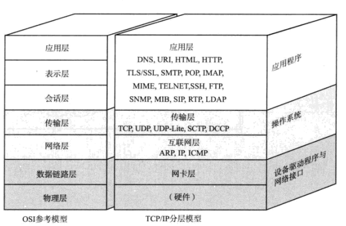


# 通信过程（数据包的封装与解封装）
## 1. 封装
每个分层，会对所发送的数据附加一个首部，在这个首部中包含了该层的必要信息，比如TCP协议添加端口信息，IP协议添加IP地址信息等。
## 2. 解封装
由最底层协议开始解析数据包数据，取出首部数据，确认该数据包是否符合处理条件，如果不符，则丢弃数据包，符合则取出数据送往上层协议程序进行解析。

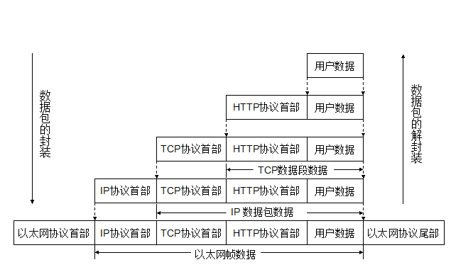

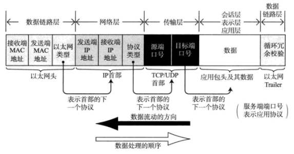

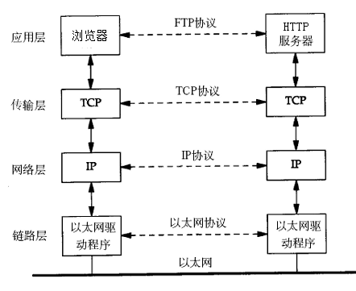

# 数据链路层
互联同一种数据链路的节点之间进行包传递。

## 1. MAC地址
网卡的“身份证”，任何一个网卡都有属于自己的唯一的MAC地址（烧在网卡里）。不过，用户也可以自己修改。
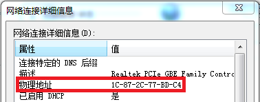 

## 2. 以太网
数据链路层中使用最广泛。最常见的以太网帧头，占14字节，包括目标MAC地址（接收方的物理地址）、源MAC地址（发送方的物理地址）、上层协议类型编号。帧尾为4个字节的帧检验序列FCS。
 
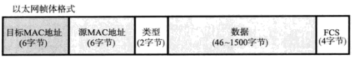

### 最常见的上层协议类型编号

|协议|类型编号|协议|类型编号|
|----|--------|----|--------|
|IPv4|0x0800|ARP|0x0806|
|IPv6|0x86DD|RARP|0x8035|

# 网络层
实现终端节点之间的通信，跨越不同的数据链路。

## IP地址
用于识别连接到网络中所有主机。 IPv4地址为32位二进制数，常见形式为十进制点符号表示法，每8位为一组，分成4组，每组以“.”隔开，再将每组数转换为十进制数，如192.168.0.1。IP地址由网络地址和主机地址两部分组成。区分方法有两种类型，最初以分类区别，现在基本以子网掩码区分。

### IP地址的分类

A类（前8位为网络标识，0.0.0.0~127.0.0.0）
B类（前16位为网络标识,，128.0.0.1~191.255.0.0）
C类（前24位为网络标识，192.168.0.0~239.255.25.0）
D类（前4位为1110,224.0.0.0~239.255.255.255.0，多播地址）

### 广播地址
用于同一链路中相互连接的主机之间发送数据包。将IP地址中的主机地址部分全部设置为1，就成为广播地址。广播分为本地广播（本网络内的广播）、直接广播（不同网络的广播）。
 
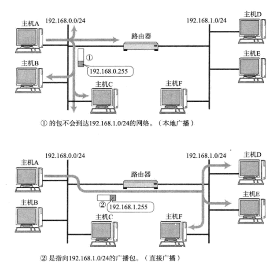

### 子网掩码
因直接使用分类地址会浪费地址资源，从而出现了用于划分网络的识别码。可将原来的分类地址中的主机部分用作子网地址，可将原网络分为多个物理网络。子网掩码必须是IP地址的首位开始连续的“1”。
 
#### 子网掩码的两种表示方法
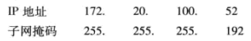
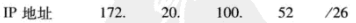


### 全局IP地址
公有地址（Public address）由Inter NIC（Internet Network Information Center因特网信息中心）负责。这些IP地址分配给注册并向Inter NIC提出申请的组织机构。通过它直接访问因特网。
私有地址：对于不需要直接与互联网相连的主终端可以属于非注册地址，专门为组织机构内部使用。
 
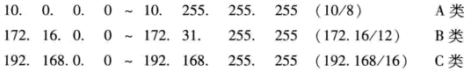

## IP数据包（IPv4）
```
版本：标识IP首部的版本号，IPv4数据包，该字段值为4。
首部长度：IP首部的大小，单位为4字节，默认为5（没有可选字段），即为20字节。
区分服务：表明服务质量，不使用。
总长度：IP包（首部+数据）长度。
标识：用于分片重组，同一分片的标识值相同，不用分片的标识值不同。
标志：第一位为0表示未使用，第二位标识表示是否进行分片（0-可以分片，1-不能分片），第三位标识表示包被分片的情况下，是否为最后一个包（0-最后一个分片的包，1-分片中段的包）。
片偏移：用于标识被分片的每一个分段相对于原始数据的位置。
生存时间：实际中是指可以中转多少个路由器的意思，没经过一个路由器，该值减少1，直到变成0则丢弃该包。
协议：上层协议类型，常见协议类型及编号见表6-1。
首部校验和：只校验数据包首部。
源地址：发送端IP地址。
目标地址：接收端IP地址。
可选项：实验或诊断时使用。
填充：当首部长度不是32比特的整数倍时，向该字段填充0，将首部长度调整为32比特的整数倍。
```

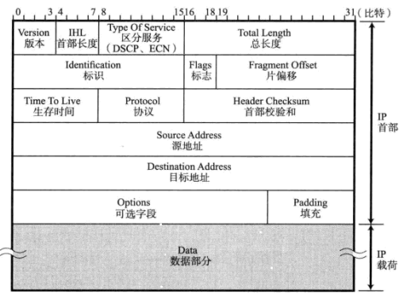

### 常见上层协议类型及编号
|协议|编号|
|----|----|
|1|ICMP|
|6|TCP|
|17|UDP|

## IP报文的分片与重组
由于以太网的默认最大传输单元MTU是1500字节，因此超过1500字节的IP数据包就无法在一个数据帧当中发送完成，需将数据包分片进行发送，最后由目标主机对接收到的数据包分片进行重组。同一分片需要目标地址、源地址、协议和标识都相同。

## 地址解析协议ARP
将IP地址解析为MAC地址。分为两种数据包ARP请求与ARP响应。
### ARP数据包
```
硬件类型：占2个字节，常为以太网（类型1,0x0001）。
高层协议类型：常为IP协议，值为0x0800。
硬件地址长度，指MAC地址，值为0x06，代表6个字节。
协议地址长度：指IP地址，值为0x04，代表4个字节。
选项/操作：占2个字节，0x0001表示请求，0x0002表示响应。
源硬件地址：6个字节，发送方MAC地址。
源高层协议地址：4个字节，发送方IP地址。
目的硬件地址：占6个字节，接收方MAC地址。
目的高层协议地址：4个字节，接收方发送方IP地址。
```

### ARP数据包结构

|硬件类型|协议类型|硬件地址长度|协议地址长度|操作|源以太网地址|源IP地址|目的以太网地址|目的IP地址|
|--------|--------|------------|------------|----|------------|--------|--------------|----------|
|2个字节 |2个字节 |6个字节 |4个字节|2个字节|6个字节|4个字节|6个字节|4个字节|

### ARP请求过程
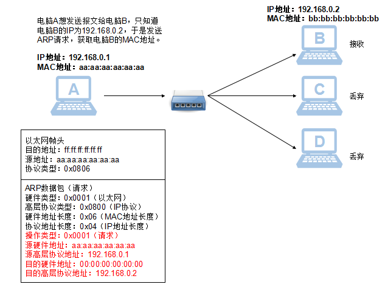
 
### ARP响应过程
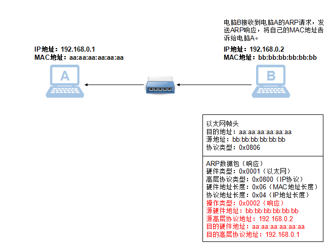

### ARP表更新
若某设备IP地址更改了，将会发送一个ARP请求包，更新其他设备的ARP表（存储MAC地址与IP地址的对应关系表）。该ARP请求包与正常的请求包的不同之处，是将目标IP地址设为自己的IP地址。

## 互联网控制消息协议ICMP
用于网络上问题诊断。

### ICMP头
|偏移位|0~15|/|16~31|
|------|----|--|-----|
|0|类型Type|代码Code|校验和Checksum|
|32|可变域Variable|

### 常见消息
|消息|类型代码（简略）|备注|
|----|----------------|----|
|回送消息（Echo请求与应答）|请求：类型8，代码0 应答：类型0，代码0|Ping工具就是使用这一协议。|
|目标不可达消息|类型3，代码1，表示主机不可达||
|超时消息|类型11|用于路由跟踪|

# 传输层
实现端到端的数据传输。
## 端口
用于识别同一台计算机中进行通信的不同应用程序。端口分两种，一种是知名、固定常用的，一种是动态随机分配的。不同传输协议可以使用相同的端口号。
## 传输控制协议TCP：面向连接的协议
### TCP头
```
源端口：用来传输数据包的端口。
目标端口：数据包将要被传输到的端口。
序列号：用来表示一个TCP片段，这个域用来保证数据流中的部分没有缺失。其初始值是在建立连接时计算机生成的随机数。每发送一次数据就累加一次该数据字节数的大小。此外，在简历连接和断开连接时的SYN包和FIN包虽然不携带数据，但会作为一个字节增加对应的序列号。
确认应答号：下一次应该收到数据的序列号。
数据偏移：占4位，表示TCP所传输的数据部分应该从TCP包的哪个位开始，可以看做是TCP首部的长度，单位为4字节。
保留：占6位，一般设置为0。
控制位（Flags）：占6位，用来表示所传输的TCP数据包的类型。 
 - URG，置1时，表示保重有需要紧急处理的数据，后面的紧急指针会解释需要紧急处理的数据。
 - ACK，置1时，确认应答的字段有效，TCP规定除了最初建立连接的SYN包之外该位必须设置为1。
 - PSH，置1时，表示需要将收到的数据立刻传给上层应用协议，为0时，先进行缓存。
 - RST，置1时，表示TCP连接中出现异常必须强制断开连接。
 - SYN，用于建立连接，为1表示希望建立连接，并在其序列号的字段进行初始值的设定。
 - FIN，置1时，表示今后不再发送数据，希望断开连接。
窗口大小：TCP接收者缓冲的字节大小。
校验和：用来保证TCP数据包的完整性。
紧急指针：当设置了URG位，紧急指针才有效。紧急指针是一个正的偏移量，和序号字段中的值相加表示紧急数据最后一个字节的序号。
选项：各种可选域，可以在TCP数据包中进行指定。最常见的可选字段是类型2，长度为4的最长报文大小（MSS），用于建立连接时决定最大段长度。
```

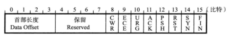
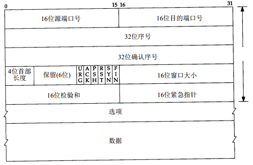

### 端口
1~1023是标准端口组，特定服务会用到这些标准端口。1024~65535是临时端口组，操作系统想在任意时间进行通信时，便会随机选择一个源端口。

常见的端口与服务

|端口号|服务名|功能|
|------|------|----|
|20|ftp-data|ftp数据传输|
|21|ftp|ftp控制|
|22|ssh|远程登录|
|23|telnet|远程登录|
|25|smtp|简单邮件传输|
|53|dns|域名解析|
|80|http|超文本传输协议|
|110|pop3|邮局协议版本|
|443|https|使用TLS/SSL的HTTP协议|

### TCP的建立连接：三次握手
1. 主机A向主机B发送一个TCP数据包，这个数据包除了底层协议头之外不包含任何数据。TCP头设置了SYN标志，并包含了初始序列号（A）和最大分段大小MSS。
2. 主机B回复了一个设置了SYN、ACK标志以及包含了它初始序列号（B）、确认号（A+1）、MSS的数据包。
3. 主机A向主机B回复一个设置ACK标志，包含序列号（A+1）、确认号（B+1）的数据包。主机A和主机B建立连接。

### TCP的终止连接：四次挥手
1. 主机A发送一个设置了FIN和ACK标志的TCP数据包（序列号A）
2. 主机B发送一个设置ACK的数据包（序列号B确认号为A+1）
3. 主机B将待发送的数据发送完毕后、发送一个设置了FIN和ACK标志的TCP数据包（序列号B+N，确认号A+1）
4. 主机A回复一个ACK包（序列号A+1，确认号B+N+1），结束连接。

### TCP重置：RST数据包
1. RST标志用来指出连接被异常中止或拒绝连接请求，RST数据包包含RST和ACK标志外，没有其他数据。

### TCP Keep-Alive机制
只要建立了TCP连接，不管多久亦或通信连接出问题，只要连接两端的主机没有重启，连接依旧保持建立。Keep-Alive机制可以为这些应用程序提供探测连接是否活动。

工作机制：我们称使用存活选项的那一段为服务器，另一端为客户端。也可以在客户端设置该选项，且没有不允许这样做的理由，但通常设置在服务器。如果连接两端都需要探测对方是否消失，那么就可以在两端同时设置（比如NFS）。

若在一个给定连接上，两小时之内无任何活动，服务器便向客户端发送一个探测段。（我们将在下面的例子中看到探测段的样子。）客户端主机必须是下列四种状态之一：

1) 客户端主机依旧活跃（up）运行，并且从服务器可到达。从客户端TCP的正常响应，服务器知道对方仍然活跃。服务器的TCP为接下来的两小时复位存活定时器，如果在这两个小时到期之前，连接上发生应用程序的通信，则定时器重新为往下的两小时复位，并且接着交换数据。

2) 客户端已经崩溃，或者已经关闭（down），或者正在重启过程中。在这两种情况下，它的TCP都不会响应。服务器没有收到对其发出探测的响应，并且在75秒之后超时。服务器将总共发送10个这样的探测，每个探测75秒。如果没有收到一个响应，它就认为客户端主机已经关闭并终止连接。

3) 客户端曾经崩溃，但已经重启。这种情况下，服务器将会收到对其存活探测的响应，但该响应是一个复位，从而引起服务器对连接的终止。

4) 客户端主机活跃运行，但从服务器不可到达。这与状态2类似，因为TCP无法区别它们两个。它所能表明的仅是未收到对其探测的回复。

服务器不必担心客户端主机被关闭然后重启的情况（这里指的是操作员执行的正常关闭，而不是主机的崩溃）。当系统被操作员关闭时，所有的应用程序进程（也就是客户端进程）都将被终止，客户端TCP会在连接上发送一个FIN。收到这个FIN后，服务器TCP向服务器进程报告一个文件结束，以允许服务器检测这种状态。

在第一种状态下，服务器应用程序不知道存活探测是否发生。凡事都是由TCP层处理的，存活探测对应用程序透明，直到后面2，3，4三种状态发生。在这三种状态下，通过服务器的TCP，返回给服务器应用程序错误信息。（通常服务器向网络发出一个读请求，等待客户端的数据。如果存活特征返回一个错误信息，则将该信息作为读操作的返回值返回给服务器。）在状态2，错误信息类似于“连接超时”。状态3则为“连接被对方复位”。第四种状态看起来像连接超时，或者根据是否收到与该连接相关的ICMP错误信息，而可能返回其它的错误信息。

具体来说：
在TCP协议的机制里面，默认是设置2小时的心跳频率。
TCP协议会向对方发一个带有ACK标志的空数据包（KeepAlive探针），对方在收到ACK包以后，如果连接一切正常，应该回复一个ACK；如果连接出现错误了（例如对方重启了，连接状态丢失），则应当回复一个RST；如果对方没有回复，服务器每隔多少时间再发ACK，如果连续多个包都被无视了，说明连接被断开了。
“心跳检测包”是属于TCP协议底层的检测机制，可以通过“以太网抓包软件”分析TCP/IP协议层的数据流看到。报文名称”TCP Keep-Alive”。

## 用户数据报协议UDP：无连接协议，提供高速的传输
### UDP头
源端口：用来传输数据包的端口。
目标端口：数据包将要被传输到的端口。
数据包长度：数据包的字节长度。
校验和：用来确保UDP数据包到达时的完整性。

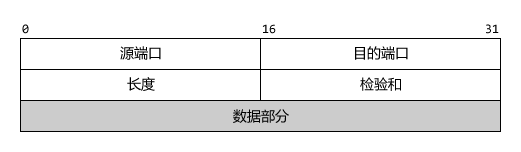

### 常见的udp端口号及对应服务
|端口号|服务名|功能|
|------|------|---|
|53|dns|域名解析|
|67|dhcp服务器|动态主机配置|
|68|dhcp客户端|动态主机配置|
|69|tftp|简单文件传输协议|

应用层协议 [应用层协议](application_protocol.md)