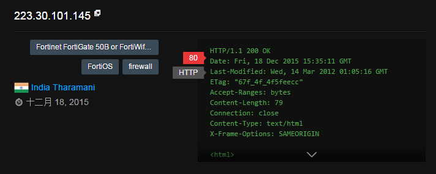
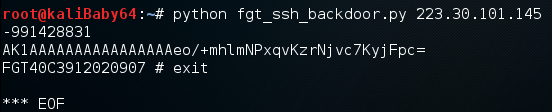
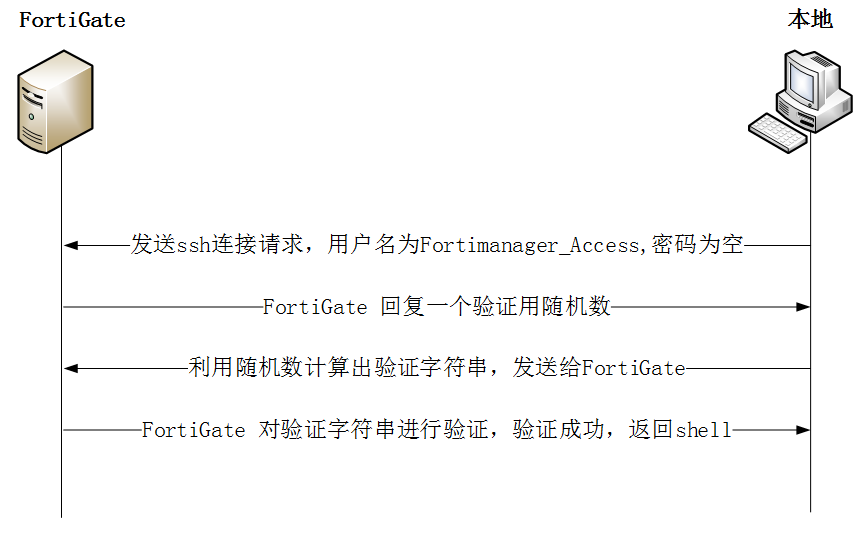

# 飞塔(FortiGate)疑似存在SSH后门（影响4.0 到 5.0.7版本）

Refer：http://www.freebuf.com/vuls/93045.html

> 2016/1/12：官方发表声明该漏洞不是后门，而是管理身份验证问题，并且于2014年7月份已经推出了补丁，但是并没有对外发布该漏洞的具体细节。

## step 1. 在ZoomEye搜索FortiGate

https://www.zoomeye.org/search?q=FortiGate 
选择一个目标。（最后修改时间为2012年）


## step 2. 使用fgt_ssh_backdoor攻击脚本

```
-991428831 服务器发给本地的一串随机数
AK1AAAAAAAAAAAAAAAAeo/+mhlmNPxqvKzrNjvc7KyjFpc=    本地利用随机数生成的验证字符串
```


## 攻击流程图：

